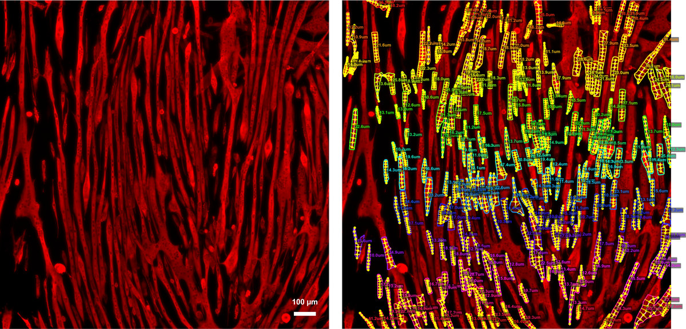

# Automated Myotube Diameter Measurement

A Python pipeline for automated segmentation and diameter measurement of myotubes in fluorescence microscopy images. Uses [Cellpose](https://github.com/MouseLand/cellpose) for instance segmentation and a skeleton-based perpendicular ray-casting method for diameter quantification.

Developed in the [Bonetto Lab](https://www.bonettolab.org/), Department of Pathology, University of Colorado Anschutz Medical Campus.



**Left:** a raw MF-20 / AF647 fluorescence field of differentiated C2C12 myotubes (10X widefield, false-coloured red). Scale bar, 100 µm.
**Right:** the same field after `run_inference.py` — morphologically filtered myotube masks (coloured contours), the medial-axis skeleton with nine perpendicular measurement chords per myotube (yellow), and the resulting mean diameter labelled on each object. Every number in the output CSV comes from these measurements.

## Overview

This tool automates the measurement of myotube diameters from MF-20/AF647 fluorescence images captured at 10X magnification. The pipeline:

1. Segments individual myotubes using Cellpose (cpsam model)
2. Filters detected objects by morphology (area, aspect ratio, circularity, solidity)
3. Skeletonizes each myotube and measures diameter at 9 equidistant points along the longest path (nine-point sampling density adopted from TRUEFAD)
4. Outputs per-myotube measurements, group summaries, and QC overlay images

### Measurement Method

Diameters are measured with a skeleton-based perpendicular ray-casting method implemented from scratch in this pipeline. The **nine-point sampling density** is adopted from **TRUEFAD** (TRUE Fiber Atrophy Distinction; [Brun et al., 2024](https://doi.org/10.1038/s41598-024-53658-0)); the measurement geometry differs — TRUEFAD samples vertical line profiles across an oriented bounding box, whereas this pipeline casts perpendicular rays along the skeleton:

- Each myotube mask is skeletonized and short branches are pruned
- The longest path through the skeleton is identified via BFS
- 9 equidistant sample points are placed along this path
- At each point, the local tangent is computed and perpendicular rays are cast in both directions
- The diameter at each point is the distance between the two mask boundaries along the perpendicular
- Per-myotube statistics (mean, median, min, max, SD) are reported across the 9 samples

### Filtering Criteria

Objects must pass all of the following to be classified as myotubes:

| Parameter | Default | Description |
|-----------|---------|-------------|
| `min_object_area` | 2000 px | Minimum mask area (~845 um^2 at 0.65 um/px) |
| `min_aspect_ratio` | 3.0 | Major/minor axis ratio (elongation) |
| `min_length_um` | 50.0 um | Minimum skeleton length |
| `max_circularity` | 0.5 | Maximum circularity (4*pi*area/perimeter^2) |
| `min_solidity` | 0.3 | Minimum solidity (area / convex hull area) |

## What this repository contains

This repository ships **code only** -- the measurement pipeline and the analysis
scripts that produced the published figures and statistics. It deliberately does
not contain data or manuscript outputs.

**Included**

| | |
|---|---|
| `myotube/` | the measurement pipeline package |
| `run_inference.py`, `measure_from_masks.py`, `convert_vsi_to_tiff.py` | command-line entry points |
| `config.yaml` | all filtering and measurement parameters |
| `Dockerfile`, `conda-lock.yml`, `environment.yml`, `requirements*.txt` | version-pinned reproducible environment |
| `tests/` | phantom test suite (the container build gate) |
| `scripts/paper_scripts_final/`, `results/IGF_dexa_combined/make_figures.py` | the analysis and figure scripts behind every published number |
| `myomeasure/figstyle.py` | shared figure typography used by those scripts |

**Not included** -- figures, supplementary tables, legends, manuscript files, and
all per-myotube measurement data. Nothing here needs them in order to run on your
own images.

## Data availability

The measurement data used in the paper is archived on Zenodo, not in this
repository:

- per-myotube `measurements.csv` for the dexamethasone plates and the C26
  conditioned-media plate
- the anonymised blinded-rater worksheets and the paired per-image table
- the source TIFFs for the deposited wells

To reproduce the published figures and statistics, download the Zenodo record and
place its contents at the paths the scripts expect (`results/<experiment>/` and
`data/subset_blinded_validation/`), then run the `compute_*.py` scripts followed by
the `make_figure*.py` scripts in `scripts/paper_scripts_final/`. Run
`results/IGF_dexa_combined/make_figures.py` first if you want the dexamethasone
statistics regenerated from the raw measurements.

`scripts/stage_zenodo_data.sh` is the helper that assembles the deposit from a
full working tree.

## Installation

### Container (recommended)

The published image pins Python, PyTorch and Cellpose-SAM, and bakes in the
`cpsam` weights, so segmentation runs offline with no setup:

```bash
docker pull ghcr.io/gammon-bio/myomeasure:1.0.0

# Segment and measure a directory of calibrated TIFFs
docker run --rm \
    -v "$PWD/data:/app/data" -v "$PWD/results:/app/results" \
    ghcr.io/gammon-bio/myomeasure:1.0.0 \
    run_inference.py data/experiment/well_A1/tiff/ -o results/my_experiment --verbose
```

The image is `linux/amd64` (add `--platform linux/amd64` on Apple Silicon) and
ships the pipeline only -- no analysis scripts, data, or manuscript material.
Optional `.vsi` conversion downloads its Bio-Formats JVM on first use, so that
one path needs network access; everything else runs offline.

### Conda environment

Requires Python 3.11+ and a conda environment with Cellpose.

```bash
# Create and activate conda environment
conda create -n cellpose python=3.11
conda activate cellpose

# Install Cellpose with GPU support
pip install cellpose[gui]

# Install remaining dependencies
pip install -r requirements.txt

# For VSI file conversion (optional)
pip install bioio bioio-bioformats
```

### GPU Support

Cellpose runs on Apple Silicon GPUs via MPS (Metal Performance Shaders) automatically when `gpu=True` is set. No additional configuration is needed. On Linux/Windows, CUDA is used if available.

> **Note:** When using Cellpose with MPS, do **not** pass `--gpu_device mps` — use `--use_gpu` alone. Explicitly setting the MPS device triggers a known Cellpose bug.

## Quick Start

### End-to-end: VSI to measurements

```bash
conda activate cellpose

# 1. Convert Olympus .vsi files to calibrated TIFF
python convert_vsi_to_tiff.py data/experiment/well_A1/

# 2. Run inference + measurement
python run_inference.py data/experiment/well_A1/tiff/ -o results/my_experiment --verbose
```

### From pre-computed Cellpose masks

If you already have `*_cp_masks.tif` files (e.g., from Cellpose GUI):

```bash
python measure_from_masks.py data/experiment/well_A1/tiff/ -o results/my_experiment
```

### Processing multiple wells at once

```bash
python run_inference.py \
    data/experiment/plate_001/A1/tiff \
    data/experiment/plate_001/A2/tiff \
    data/experiment/plate_001/B1/tiff \
    -o results/my_experiment \
    --verbose
```

### Specific use case: multi-plate experiment with per-well VSI files

When the dataset is laid out as `data/real/<EXPERIMENT>/Well plate_<NN>/<WELL>/*.vsi` — one `.vsi` per snapshot, each well in its own subdirectory, conditions encoded in the filename prefix (e.g. `Control_Snapshot_*.vsi`, `Treated_Snapshot_*.vsi`) — process the whole experiment with a two-step pipeline. Replace `my_cm_experiment` with your experiment name; the glob pattern handles spaces in `Well plate_001`/`Well plate_002` and any number of wells per plate.

```bash
conda activate cellpose
cd "/path/to/myotube"

EXPT=my_cm_experiment   # rename to your experiment

# 1. Convert every well's .vsi files to calibrated TIFF.
#    convert_vsi_to_tiff.py is per-directory, so loop the wells. Each call
#    writes "<well>/tiff/*.tif" with um/pixel embedded from the VSI metadata.
for well in "data/real/${EXPT}/Well plate_001"/*/ "data/real/${EXPT}/Well plate_002"/*/; do
    python convert_vsi_to_tiff.py "$well"
done

# 2. Run inference on every "<well>/tiff" directory in a single invocation.
#    Loading the cpsam model once is much faster than per-well calls.
python run_inference.py \
    -o "results/${EXPT}" \
    "data/real/${EXPT}/Well plate_001"/*/tiff \
    "data/real/${EXPT}/Well plate_002"/*/tiff
```

What lands where:

- **TIFFs**: `data/real/<EXPT>/Well plate_<NN>/<WELL>/tiff/*.tif`
- **Per-image masks** (alongside originals): `*_cp_masks.tif`
- **Per-myotube measurements**: `results/<EXPT>/measurements.csv` (one row per myotube; `group` column = `Well plate_001/A1` etc.)
- **Per-well summary**: `results/<EXPT>/group_summary.csv`
- **QC overlays**: `results/<EXPT>/*_measurement_overlay.png`
- **Log**: `results/<EXPT>/processing.log`

Add as many plate directories as you have — the `"data/real/${EXPT}/Well plate_*/*/tiff"` glob will fan out to every well across every plate.

Conditions are recovered downstream from the image-filename prefix. If your filenames look like `Control_Snapshot_*.tif`, `Treated_Snapshot_*.tif`, etc., a one-line regex pulls the condition: `df["condition"] = df["image"].str.extract(r"^(.+?)_Snapshot")[0]`. See `results/IGF_dexa_combined/make_figures.py` for a worked example (well-level dot plot with one-way ANOVA + violin plot of all measurements, with a configurable reference condition).

## Core Scripts

### `run_inference.py`

Main entry point. Runs Cellpose segmentation followed by filtering and measurement in a single command.

```
python run_inference.py <dir1> [<dir2> ...] [-o output_dir] [--model cpsam] [--verbose]
```

**Cellpose settings** (match GUI defaults):
- Model: `cpsam` (Cellpose Segment Anything)
- Diameter: auto-estimated
- Flow threshold: 0.4
- Cell probability threshold: 0.0
- No preprocessing, no fragment merging, no uint8 conversion

**Options:**
| Flag | Description |
|------|-------------|
| `-o, --output-dir` | Output directory (default: `results/`) |
| `--model` | Cellpose model name (default: `cpsam`) |
| `--pixel-size` | Override pixel size in um/px (default: read from TIFF metadata) |
| `--no-save-masks` | Skip saving `*_cp_masks.tif` files alongside originals |
| `--no-overlay` | Skip QC overlay generation |
| `--verbose` | Enable debug logging |

**Outputs:**
- `measurements.csv` — Per-myotube measurements (image, group, label_id, diameters, length, area, etc.)
- `group_summary.csv` — Per-group aggregate statistics
- `summary.png` — Overview figure
- `*_measurement_overlay.png` — Per-image QC overlays with skeleton and diameter annotations
- `*_cp_masks.tif` — Cellpose masks saved alongside originals (for review/re-measurement)
- `processing.log` — Full processing log

### `measure_from_masks.py`

Measures diameters from pre-existing Cellpose masks. Useful when masks have been generated or manually edited in the Cellpose GUI.

```
python measure_from_masks.py <dir1> [<dir2> ...] [-o output_dir] [--mask-suffix _cp_masks.tif]
```

Expects each directory to contain pairs of `<name>.tif` (original image) and `<name>_cp_masks.tif` (mask). Produces the same outputs as `run_inference.py`.

### `convert_vsi_to_tiff.py`

Converts Olympus `.vsi` microscopy files to 16-bit TIFF with embedded pixel calibration (ImageJ-compatible).

```
python convert_vsi_to_tiff.py <input_dir> [-o output_dir] [-s scene_name]
```

Creates a `tiff/` subdirectory inside the input directory by default. Preserves the original pixel calibration from the VSI metadata (typically 0.65 um/px for 10X).

## Project Structure

```
myotube/
├── run_inference.py          # Main pipeline: Cellpose + filter + measure
├── measure_from_masks.py     # Measure from pre-computed masks
├── convert_vsi_to_tiff.py    # VSI-to-TIFF converter
├── config.yaml               # Default filtering/measurement parameters
├── requirements.txt          # Python dependencies
├── requirements-cellpose.txt # Cellpose dependency
│
├── myotube/                  # Core library
│   ├── __init__.py
│   ├── config.py             # Config class and CLI parser
│   ├── filtering.py          # Morphological filtering (area, AR, circularity, etc.)
│   ├── measurement.py        # Skeleton + ray-casting diameter measurement (9-pt density after TRUEFAD)
│   ├── visualization.py      # Overlay and summary figure generation
│   └── io.py                 # Image I/O, pixel size parsing, CSV export
│
├── data/                     # Raw image data (not tracked in git)
│   ├── real/                 # Experimental images
│   └── train/                # Cellpose training data and models
│
├── results/                  # Inference outputs (not tracked in git; see Data availability)
│   ├── IGF_dexa/              # dexamethasone dose-response (plate 004)
│   ├── IGF_dexa_plate005/     #   "                        (plate 005)
│   ├── IGF_dexa_combined/     # pooled dexamethasone stats + figures
│   └── c26_cm_exp2_inference/ # C26 conditioned media
│
├── reports/                  # Validation reports and manuscript figures (not tracked in git)
│
├── scripts/                  # Report and manuscript generation scripts
│   ├── generate_validation_report.py
│   ├── generate_validation_report_2.py
│   ├── generate_star_protocols.js
│   └── generate_star_protocols_v2.py
│
└── archive/                  # Superseded scripts and intermediate results
```

## Output Format

### measurements.csv

Each row is one myotube:

| Column | Description |
|--------|-------------|
| `image` | Source image filename |
| `group` | Well/condition group (derived from directory structure) |
| `label_id` | Mask label ID |
| `mean_diameter` | Mean diameter across 9 sample points (um) |
| `median_diameter` | Median diameter (um) |
| `min_diameter` | Minimum diameter (um) |
| `max_diameter` | Maximum diameter (um) |
| `std_diameter` | Standard deviation of diameter (um) |
| `length` | Skeleton length (um) |
| `area` | Mask area (um^2) |
| `aspect_ratio` | Major/minor axis ratio |
| `n_branches` | Number of skeleton branches |
| `unit` | Measurement unit (um) |

### Group Derivation

Groups are automatically derived from the directory structure:

| Directory Path | Derived Group |
|---------------|---------------|
| `data/Experiment_1/A3/tiff/` | `A3` |
| `data/real/c26_cm/Well plate_016/A1/tiff/` | `Well plate_016/A1` |
| `data/experiment/Control/A1/tiff/` | `Control/A1` |

## Configuration

Filtering and measurement parameters can be adjusted in `config.yaml`. The most commonly tuned parameters:

```yaml
# Filtering — adjust based on image magnification and cell morphology
min_object_area: 2000       # Increase for higher magnification
min_aspect_ratio: 3.0       # Decrease to include shorter/wider myotubes
max_circularity: 0.5        # Increase to include rounder objects

# Measurement
num_diameter_samples: 9     # Number of perpendicular measurements per myotube
skeleton_prune_length: 20   # Branch pruning threshold (pixels)

# Scale
pixel_size: null            # Set explicitly if TIFF metadata is missing (um/px)
```

> **Note:** `run_inference.py` only reads filtering/measurement parameters from `config.yaml`. Cellpose parameters (model, diameter, flow threshold, cellprob threshold) are hardcoded to match validated GUI settings and are not read from the config file.

## Validation

The pipeline has been validated against manual measurements from three independent blinded expert raters on a C26 conditioned-media subset, and biologically against established atrophy models (dexamethasone dose-response and C26 conditioned media), comparing:

- **Manual** measurements (operator-selected myotubes, ImageJ)
- **GUI-based** Cellpose segmentation (masks generated in Cellpose GUI, measured with `measure_from_masks.py`)
- **CLI-based** inference (`run_inference.py`, fully automated)

Key findings:
- GUI and CLI produce nearly identical results (same cpsam model and parameters)
- Automated measurement detects 5-10x more myotubes per image than manual selection
- Automated methods capture the full diameter distribution, including small myotubes (<10 um) that manual operators tend to skip
- The pipeline correctly detects published atrophic stimuli (C26 conditioned media produces significant diameter reduction vs. vehicle controls, p < 0.001)

Validation reports are generated by scripts in `scripts/` and output to `reports/`.

## Experiments Processed

| Experiment | Treatment | Groups | Images | Myotubes | Location |
|-----------|-----------|--------|--------|----------|----------|
| Dexamethasone dose-response | Dexamethasone | Vehicle, 0.1 µM, 1 µM, 10 µM | 120 | ~22,500 | `results/IGF_dexa/`, `results/IGF_dexa_plate005/` |
| C26 conditioned media | C26 CM vs vehicle | Con_Veh, C26_CM | 30 | 6,712 | `results/c26_cm_exp2_inference/` |

## Dependencies

**Core:**
- Python 3.11+
- NumPy, SciPy, pandas, matplotlib
- scikit-image, OpenCV
- tifffile, PyYAML

**Segmentation:**
- Cellpose >= 3.0 (with cpsam model)

**VSI conversion (optional):**
- bioio, bioio-bioformats

## License

Code in this repository is released under the **MIT License** (see `LICENSE`).

Non-software content -- the manuscript figures, measurement CSVs, supplementary
tables, blinded-rater worksheets, and the deposited microscopy images and masks
in the Zenodo record -- is released under **CC BY 4.0** (see `LICENSE-data`).

Copyright (c) 2026 Caleb J. Gammon and the Bonetto Lab, University of Colorado
Anschutz Medical Campus.
